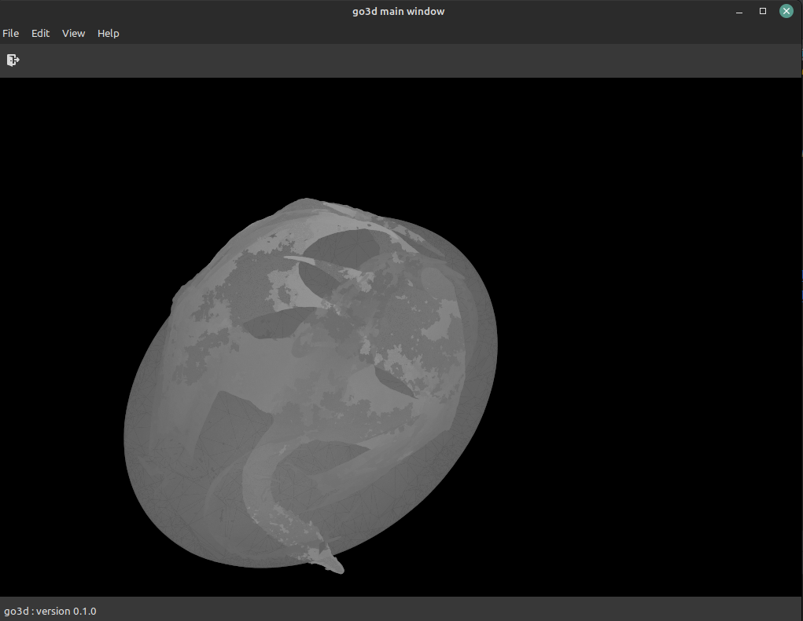

## PLY-VIEWER

A viewer for the PLY 3D-object format.

[WIP] It is written using GTK, and it is horribly slow and my code is buggy as hell, but if you look closely you can see that it is a dragon below, right?. I just wanted to see if I could kind of make it work, and this is good enough for me :-)...

# LINKS

A real 3D mesh viewer : https://www.meshlab.net/#download
Some free PLY files : https://www.artec3d.com/3d-models/ply

# TODO
